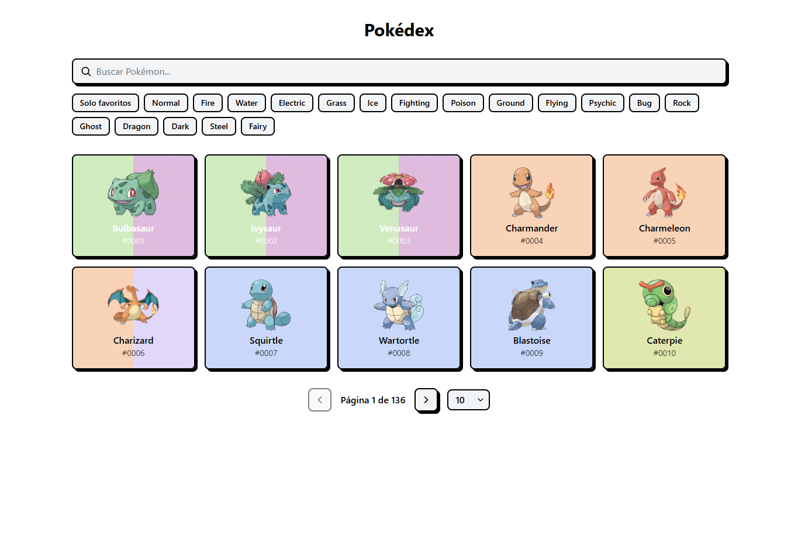
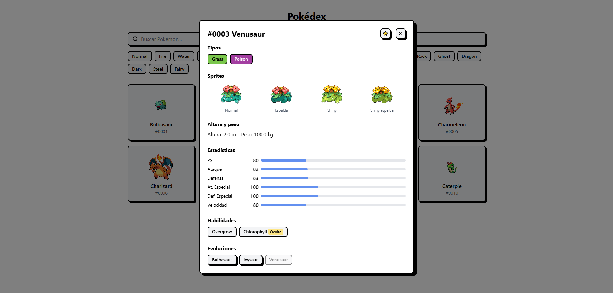
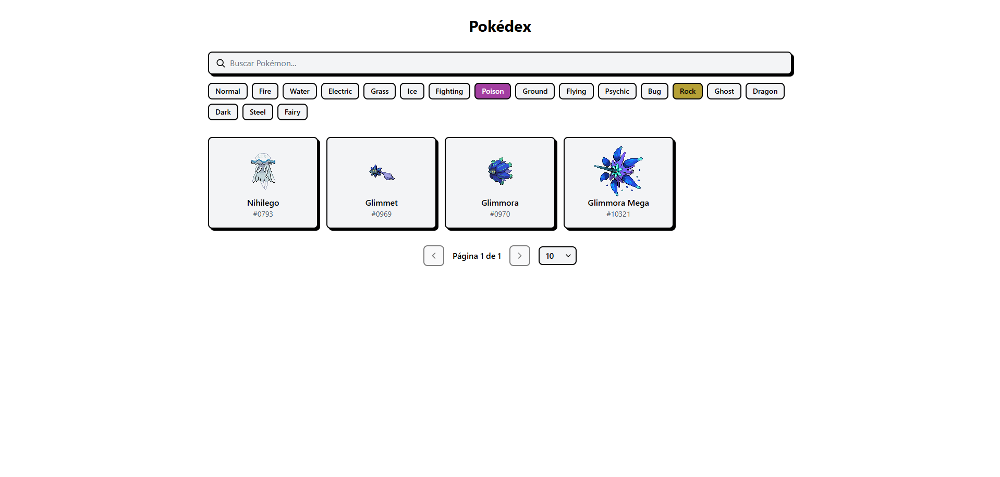
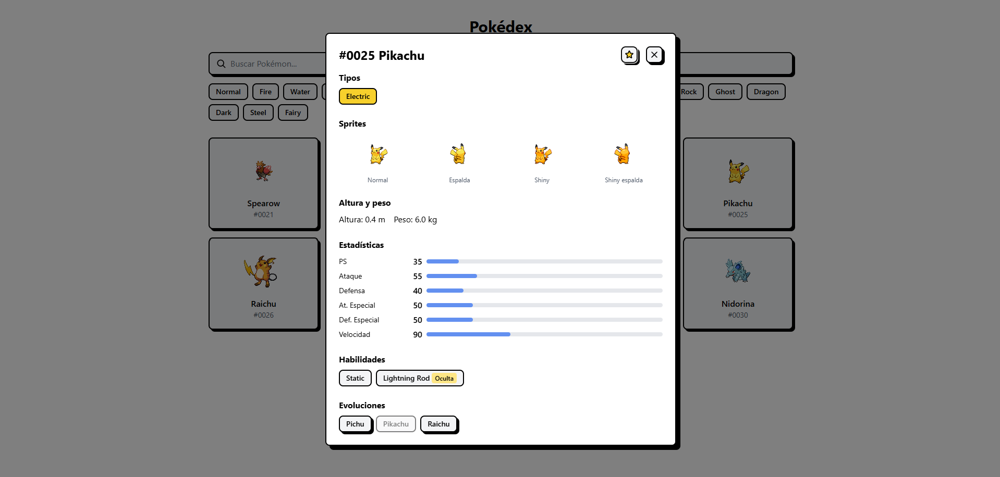
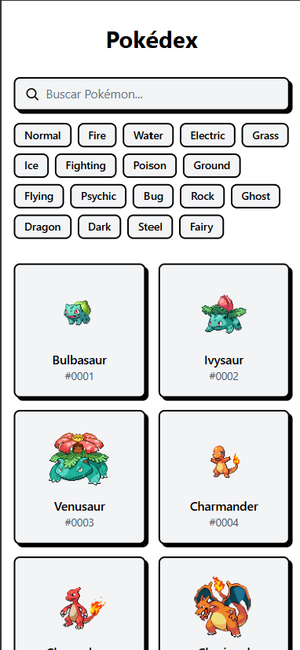

# Pokédex App

Una Pokédex web responsiva construida con React, TypeScript y Vite que
permite explorar Pokémon, buscar por nombre, filtrar por tipo, ver
detalles completos (stats, habilidades, evoluciones) y guardar favoritos
sin necesidad de crear una cuenta.

**[Ver demo en vivo](https://pokedex-app-delta-blush.vercel.app/)**



## Características

- Búsqueda por nombre (soporta nombre completo o parcial, incluye formas alternativas)
- Filtro por tipo con intersección (solo muestra Pokémon que tienen **todos** los tipos seleccionados)
- Paginación configurable: 10, 25, 50 o 100 Pokémon por página
- Modal de detalle con:
  - Sprites normales y shiny (frente y espalda)
  - Tipos con colores oficiales y contraste calculado por luminancia WCAG
  - Stats base con barras visuales proporcionales
  - Habilidades normales y ocultas (con badge distintivo)
  - Altura y peso en unidades humanas
  - Cadena de evoluciones clicables que navegan al Pokémon seleccionado
- Sistema de favoritos con persistencia en `localStorage`
- Interfaz responsive (mobile-first)
- Estilo neo-brutalist coherente en todos los componentes
- Estados de carga, error y "sin resultados" manejados explícitamente

## Stack

- **Frontend**: React 19 + TypeScript
- **Build**: Vite
- **Estilos**: Tailwind CSS v4 (CSS-first)
- **Datos**: [PokéAPI](https://pokeapi.co/) (REST, sin autenticación)
- **Estado**: React hooks (`useState`, `useEffect`) + Context API
- **Persistencia**: `localStorage` para favoritos
- **Deploy**: Vercel

## Cómo empezar

```bash
git clone https://github.com/joseMellaMat/pokedex-app.git
cd pokedex-app
npm install
npm run dev
```
Abre http://localhost:5173 en tu navegador.

## Scripts disponibles

| Comando | Descripción |
| --- | --- |
| `npm run dev` | Servidor de desarrollo con HMR |
| `npm run build` | Typecheck (`tsc -b`) + build de producción |
| `npm run lint` | Ejecuta ESLint |
| `npm run preview` | Previsualiza el build de producción |

## Arquitectura

El proyecto sigue una separación clara de responsabilidades. Las dependencias fluyen en una sola dirección: 
`components` → `hooks` → `lib` → `API`.

```text
src/
├── components/       # Componentes de UI (reciben props, no fetchean)
│   └── ui/           # Componentes reutilizables (Spinner, ErrorMessage)
├── hooks/            # Lógica de estado y datos
├── lib/              # Lógica pura (fetch API, colores, formateo)
├── context/          # Estado global (favoritos)
└── types/            # Tipos e interfaces TypeScript
```

Más detalles sobre las decisiones de diseño en ARCHITECTURE.md.

## Estrategia de datos

La app carga el índice completo de Pokémon una vez al montar (GET /pokemon?limit=100000) y trabaja en memoria para búsqueda, filtro y paginación. Los detalles se cargan bajo demanda solo cuando el usuario abre el modal. Este diseño elimina el problema N+1 de hacer un fetch por tarjeta y permite búsqueda instantánea sin debounce.

## Proceso de desarrollo

Este proyecto fue construido usando OpenCode (un agente de IA para desarrollo) con un flujo estructurado por archivos de contexto que gobiernan el comportamiento del agente:

- **AGENTS.md** — Convenciones de código, comandos, reglas duras y flujo de trabajo
- **SPECS.md** — Alcance funcional, endpoints de API y criterios de aceptación
- **ARCHITECTURE.md** — Decisiones técnicas, estructura de carpetas y estrategia de datos

Cada feature se planifica en modo Plan (sin escribir código), se revisa, y solo entonces pasa a modo Build. Todas las verificaciones pasan por npm run build y npm run lint antes de commitear, siguiendo Conventional Commits.

## Capturas 

### Modal de detalle


### Filtro por tipo activo


### Favoritos


### Vista mobile


## Deploy

El proyecto se despliega automáticamente en Vercel con cada push a main. Los Pull Requests generan Preview Deployments con URLs únicas para verificar cambios antes de mergear.

## Licencia

MIT